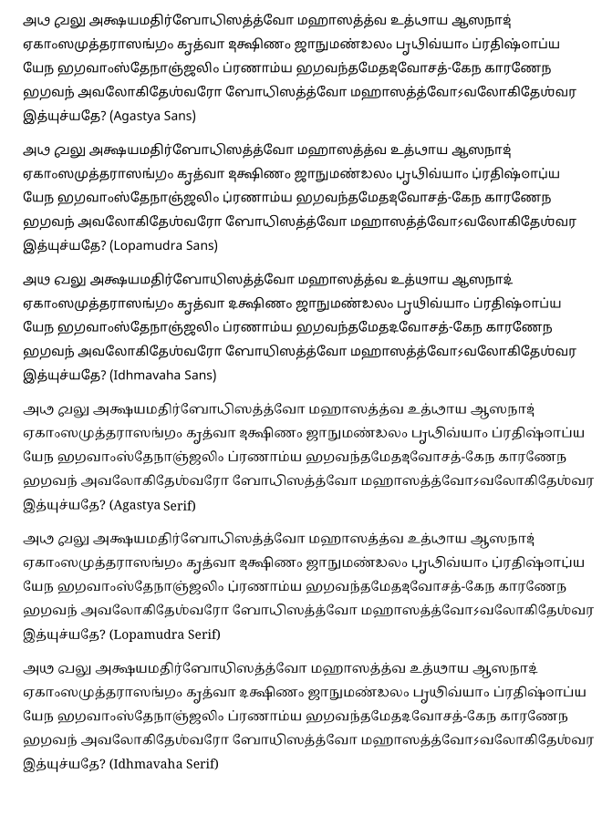

# Agastya and Lopamudra for Extended Tamil
Agastya, Lopamudra & Idhmavaha are Unicode fonts for the Extended Tamil script, an experimental attempt to use the full complimentary set of Grantha letters to fill in the gaps in the Tamil script (as compared to the pan-Indic system).

This method was sporadically experimented from the late 1800's up until the middle part of the 20th century. One such publication from 1905 can be seen [here](https://archive.org/stream/bhojacharitrama00sastgoog#page/n534/mode/2up).

You can read the documentation of the fonts [here](http://www.virtualvinodh.com/projects/agastya)

# Sample #

अथ खलु अक्षयमतिर्बोधिसत्त्वो महासत्त्व उत्थाय आसनादेकांसमुत्तरासङ्गं कृत्वा दक्षिणं जानुमण्डलं पृथिव्यां प्रतिष्ठाप्य येन भगवांस्तेनाञ्जलिं प्रणाम्य भगवन्तमेतदवोचत्-केन कारणेन भगवनवलोकितेश्वरो बोधिसत्त्वो महासत्त्वोऽवलोकितेश्वर इत्युच्यते?

atha khalu akṣayamatirbodhisattvo mahāsattva utthāya āsanādekāṃsamuttarāsaṅgaṃ kṛtvā dakṣiṇaṃ jānumaṇḍalaṃ pṛthivyāṃ pratiṣṭhāpya yena bhagavāṃstenāñjaliṃ praṇāmya bhagavantametadavocat-kena kāraṇena bhagavanavalokiteśvaro bodhisattvo mahāsattvo'valokiteśvara ityucyate?

அத² க²லு அக்ஷயமதிர்போ³தி⁴ஸத்த்வோ மஹாஸத்த்வ உத்தா²ய ஆஸநாதே³காம்ʼஸமுத்தராஸங்க³ம்ʼ க்ருʼத்வா த³க்ஷிணம்ʼ ஜாநுமண்ட³லம்ʼ ப்ருʼதி²வ்யாம்ʼ ப்ரதிஷ்டா²ப்ய யேந ப⁴க³வாம்ʼஸ்தேநாஞ்ஜலிம்ʼ ப்ரணாம்ய ப⁴க³வந்தமேதத³வோசத்-கேந காரணேந ப⁴க³வநவலோகிதேஶ்வரோ போ³தி⁴ஸத்த்வோ மஹாஸத்த்வோ(அ)வலோகிதேஶ்வர இத்யுச்யதே?

# Demo Page #

You can find various texts rendered both in Agastya and Lopamudra [here](https://virtualvinodh.github.io/agastya-tamil-extended/test_page.html)

